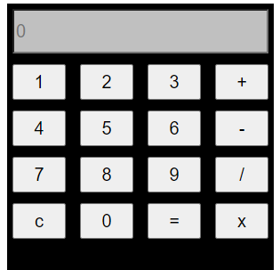

# Simple Calculator

This is a repository for a simple calculator application built with JavaScript, HTML, and CSS.

## Features

- Addition, subtraction, multiplication, and division operations
- Clear button to reset the calculator
- Responsive design for use on different devices

## Getting Started

To get a local copy of the calculator application, you can follow these steps:

1. Clone the repository:

   git clone https://github.com/Gichbuoy/simple-calculator.git

2. Open calc.html on your web browser

### Usage
1. Enter the numbers you want to perform calculations on using the number buttons.

2. Click on the operation buttons (+, -, x, /) to perform the corresponding operation.

3. The result will be displayed in the calculator's display area.

4. To clear the calculator and start a new calculation, click the "c" button.

### Contributing
Contributions are welcome! If you have any suggestions, bug fixes, or new features to propose, please feel free to submit a pull request.

### screenshot

